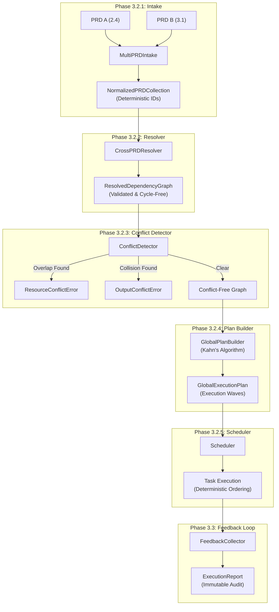

# Lexicon: Multi-PRD Orchestration Pipeline

The following diagram illustrates the structural flow of the Lexicon orchestration engine, from initial PRD ingestion to final execution feedback.

## Key Architectural Principles
- **Deterministic**: The same input always produces the same execution order.
- **Fail-Fast**: Structural, dependency, or conflict errors are caught before execution begins.
- **Isolated**: Clear separation of concerns between planning (3.2.1-3.2.4) and execution (3.2.5-3.3).
- **Immutable**: All intermediate and final reports are immutable for reliable auditing.
