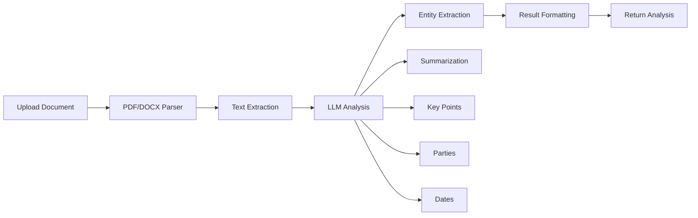
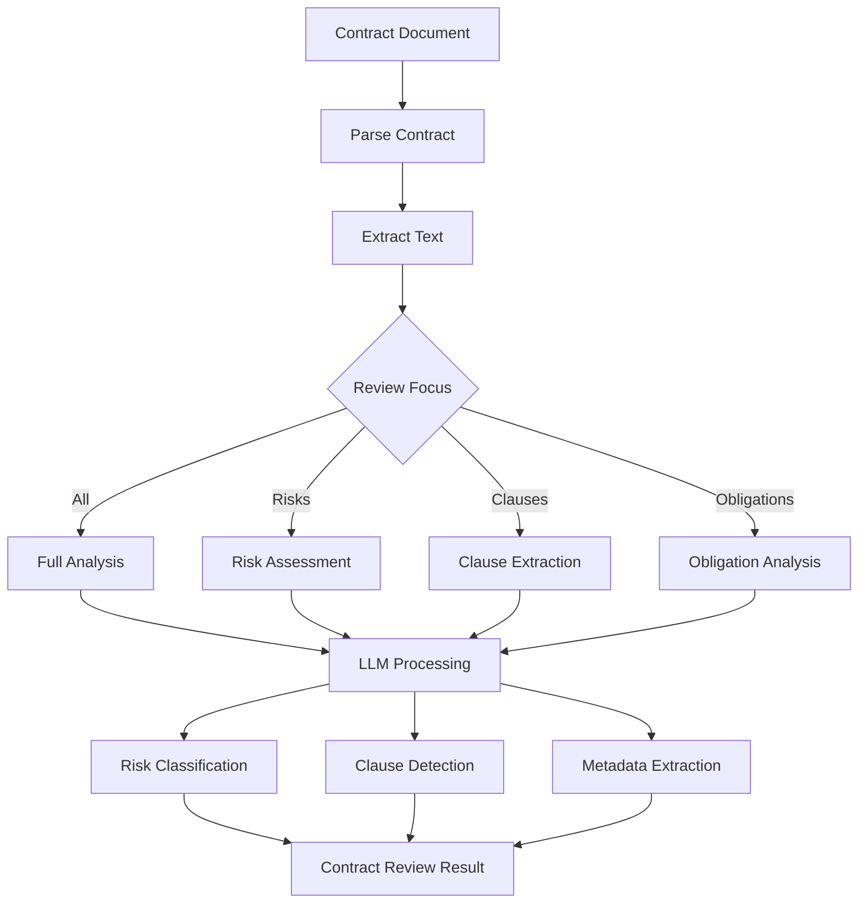
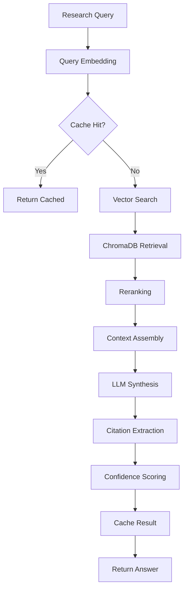
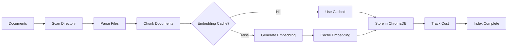

# Lexicon System Architecture

## Table of Contents

- [Overview](#overview)
- [High-Level Architecture](#high-level-architecture)
- [Component Architecture](#component-architecture)
- [Data Flow](#data-flow)
- [Technology Stack](#technology-stack)
- [Design Patterns](#design-patterns)
- [Database Schema](#database-schema)
- [Vector Store Architecture](#vector-store-architecture)
- [LLM Integration Strategy](#llm-integration-strategy)
- [Performance Optimizations](#performance-optimizations)

## Overview

Lexicon is an AI-powered legal document analysis and research platform built with a clean, modular architecture. The system follows Domain-Driven Design (DDD) principles and implements a layered architecture pattern to ensure maintainability, testability, and scalability.

### Core Principles

- **Separation of Concerns**: Clear boundaries between domain logic, application services, and infrastructure
- **Dependency Inversion**: Domain layer has no dependencies on external frameworks
- **Single Responsibility**: Each component has a well-defined purpose
- **Open/Closed**: Extensible without modifying core components
- **Clean Architecture**: Business logic isolated from external dependencies

## High-Level Architecture

```
┌─────────────────────────────────────────────────────────────────────┐
│                        Presentation Layer                           │
│  ┌──────────────────────────┐    ┌──────────────────────────┐     │
│  │      CLI Interface        │    │      REST API (FastAPI)  │     │
│  │  (Typer + Rich UI)        │    │    (OpenAPI/Swagger)     │     │
│  └──────────────────────────┘    └──────────────────────────┘     │
└─────────────────────────────────────────────────────────────────────┘
                               ↓
┌─────────────────────────────────────────────────────────────────────┐
│                       Application Services                          │
│  ┌─────────────┐ ┌──────────────┐ ┌──────────────┐ ┌────────────┐ │
│  │  Document   │ │  Contract    │ │    Legal     │ │    RAG     │ │
│  │  Analysis   │ │   Review     │ │   Research   │ │Orchestrator│ │
│  └─────────────┘ └──────────────┘ └──────────────┘ └────────────┘ │
└─────────────────────────────────────────────────────────────────────┘
                               ↓
┌─────────────────────────────────────────────────────────────────────┐
│                          Domain Layer                               │
│  ┌──────────────┐  ┌──────────────┐  ┌──────────────┐            │
│  │   Entities   │  │   Parsers    │  │  LLM Base    │            │
│  │ • Document   │  │ • PDF        │  │  Interface   │            │
│  │ • Contract   │  │ • DOCX       │  │              │            │
│  │ • Research   │  │ • Chunker    │  │              │            │
│  └──────────────┘  └──────────────┘  └──────────────┘            │
└─────────────────────────────────────────────────────────────────────┘
                               ↓
┌─────────────────────────────────────────────────────────────────────┐
│                      Infrastructure Layer                           │
│  ┌──────────────┐  ┌──────────────┐  ┌──────────────┐            │
│  │ LLM Clients  │  │ Vector Store │  │    Cache     │            │
│  │ • OpenAI     │  │ • ChromaDB   │  │ • Redis      │            │
│  │ • Anthropic  │  │              │  │              │            │
│  └──────────────┘  └──────────────┘  └──────────────┘            │
│  ┌──────────────┐  ┌──────────────┐  ┌──────────────┐            │
│  │  Database    │  │   Prompts    │  │   Config     │            │
│  │ • PostgreSQL │  │  Management  │  │  Management  │            │
│  └──────────────┘  └──────────────┘  └──────────────┘            │
└─────────────────────────────────────────────────────────────────────┘
```

## Component Architecture

### 1. Presentation Layer

#### CLI Interface (`lexicon/cli/`)
- **Technology**: Typer for command parsing, Rich for terminal UI
- **Commands**:
  - `analyze` - Document analysis workflow
  - `review` - Contract review workflow
  - `research` - Legal research workflow
  - `index` - Document indexing workflow
- **Features**:
  - Progress bars for long-running operations
  - Colorized output with severity indicators
  - JSON and text output formats
  - File output support

#### REST API (`lexicon/api/`)
- **Technology**: FastAPI with automatic OpenAPI documentation
- **Endpoints**:
  - `/api/v1/documents/*` - Document operations
  - `/api/v1/contracts/*` - Contract operations
  - `/api/v1/research/*` - Research operations
  - `/api/v1/knowledge-base/*` - Knowledge base management
- **Features**:
  - Async request handling
  - Request validation with Pydantic
  - CORS middleware
  - Error handling middleware
  - Automatic API documentation (Swagger/ReDoc)

### 2. Application Services (`lexicon/services/`)

#### DocumentAnalysisService
- Orchestrates document analysis workflow
- Integrates parsers, LLMs, and entity extraction
- Provides summarization, key point extraction, party identification

#### ContractReviewService
- Comprehensive contract review
- Risk assessment with severity classification
- Clause extraction and analysis
- Unusual clause detection

#### LegalResearchService
- RAG-based legal research
- Query processing and document retrieval
- Citation extraction
- Confidence and relevance scoring

#### RAGOrchestrator
- Central orchestrator for RAG pipeline
- Document indexing workflow
- Query processing with reranking
- Context assembly for LLM prompts
- Cost tracking for API usage

#### Reranker
- BM25-based reranking
- Similarity scoring (Jaccard, cosine)
- Batch processing support

### 3. Domain Layer (`lexicon/domain/`)

#### Entities (`domain/entities/`)
Core business entities with validation:
- **Document**: File metadata, content, status
- **Contract**: Contract-specific data, parties, clauses, risks
- **ResearchQuery**: Query parameters, filters, context
- **ResearchResult**: Answer, citations, sources, scores

#### Parsers (`domain/parsers/`)
Document parsing implementations:
- **PDFParser**: PyMuPDF-based PDF extraction
- **DOCXParser**: python-docx-based DOCX extraction
- **Chunker**: Smart text chunking with document-type awareness

#### LLM Base (`domain/llm/`)
Abstract base classes for LLM providers:
- **BaseLLMProvider**: Common interface for all LLM implementations
- **Message, Role**: Standard message formats
- **Token counting utilities**

#### Vector Store (`domain/vector_store/`)
Abstract base for vector storage:
- **BaseVectorStore**: Interface for vector database operations
- **Search, indexing, and metadata operations**

### 4. Infrastructure Layer (`lexicon/infrastructure/`)

#### LLM Clients
- **OpenAIClient**: GPT-4o, GPT-4o-mini integration
- **AnthropicClient**: Claude 3.5 Sonnet integration
- Features: Retry logic, rate limiting, cost tracking

#### Vector Store
- **ChromaVectorStore**: ChromaDB implementation
- Persistent storage with metadata filtering
- Efficient similarity search

#### Cache
- **CacheClient**: Redis-based caching
- Embedding cache (reduce API calls)
- Semantic query cache (improve response time)
- Graceful degradation if Redis unavailable

#### Database
- **PostgreSQL**: Structured data storage (future use)
- **SQLAlchemy**: ORM and migrations

#### Shared Components (`lexicon/shared/`)
- **Config**: Pydantic settings with environment variables
- **Prompts**: Centralized prompt templates
- **RetryHandler**: Exponential backoff retry logic
- **TokenCounter**: Token counting and cost estimation

## Data Flow

### 1. Document Analysis Pipeline



**Flow Description**:
1. User uploads PDF/DOCX via CLI or API
2. File is parsed using appropriate parser (PDF/DOCX)
3. Text is extracted and cleaned
4. LLM performs comprehensive analysis:
   - Document classification
   - Summarization
   - Key point extraction
   - Party identification
   - Date extraction
5. Results are structured and returned

### 2. Contract Review Pipeline



**Flow Description**:
1. Contract is parsed and text extracted
2. User specifies focus area (risks, clauses, obligations, or all)
3. LLM analyzes contract based on focus
4. Risks are classified by severity (HIGH, MEDIUM, LOW)
5. Clauses are extracted and categorized
6. Unusual clauses are flagged
7. Comprehensive review report is generated

### 3. Legal Research Pipeline (RAG)



**Flow Description**:
1. User submits research query with optional filters
2. Query is embedded using OpenAI embeddings
3. Check semantic cache for similar queries
4. If miss, perform vector similarity search in ChromaDB
5. Retrieve top-k relevant document chunks
6. Rerank results using BM25 algorithm
7. Assemble context from top results
8. LLM synthesizes comprehensive answer
9. Extract legal citations from sources
10. Calculate confidence and relevance scores
11. Cache result for future queries
12. Return research result with sources

### 4. Document Indexing Pipeline



**Flow Description**:
1. Scan directory for PDF/DOCX files
2. Parse each document
3. Chunk text based on document type:
   - Contracts: 512 tokens, 50 overlap
   - Case law: 1024 tokens, 100 overlap
   - General: 768 tokens, 75 overlap
4. Check embedding cache for each chunk
5. Generate embeddings for uncached chunks
6. Store embeddings and metadata in ChromaDB
7. Track API costs
8. Report indexing statistics

## Technology Stack

### Core Technologies

| Component | Technology | Version | Purpose |
|-----------|-----------|---------|---------|
| Language | Python | 3.11+ | Primary development language |
| Dependency Management | Poetry | 1.0+ | Package and dependency management |
| CLI Framework | Typer | 0.9+ | Command-line interface |
| CLI UI | Rich | 13.7+ | Terminal formatting and progress |
| API Framework | FastAPI | 0.109+ | REST API with auto-documentation |
| ASGI Server | Uvicorn | 0.27+ | High-performance async server |
| Data Validation | Pydantic | 2.6+ | Schema validation and settings |

### AI/ML Stack

| Component | Technology | Version | Purpose |
|-----------|-----------|---------|---------|
| Primary LLM | OpenAI GPT-4o | Latest | Complex analysis tasks |
| Secondary LLM | OpenAI GPT-4o-mini | Latest | Simple tasks, cost optimization |
| Fallback LLM | Claude 3.5 Sonnet | Latest | Backup provider |
| Embeddings | text-embedding-3-large | Latest | Vector embeddings (3072 dim) |
| Vector Database | ChromaDB | 0.4.22+ | Document vector storage |
| LLM SDK | OpenAI Python | 1.10+ | OpenAI API client |
| LLM SDK | Anthropic Python | 0.18+ | Anthropic API client |

### Infrastructure

| Component | Technology | Version | Purpose |
|-----------|-----------|---------|---------|
| Database | PostgreSQL | 15+ | Structured data storage |
| ORM | SQLAlchemy | 2.0+ | Database abstraction |
| DB Driver | psycopg | 3.1+ | PostgreSQL driver |
| Cache | Redis | 5.0+ | Performance caching |
| Cache Client | redis-py | 5.0+ | Redis Python client |

### Document Processing

| Component | Technology | Version | Purpose |
|-----------|-----------|---------|---------|
| PDF Parser | PyMuPDF | 1.23+ | PDF text extraction |
| DOCX Parser | python-docx | 1.1+ | DOCX text extraction |
| Tokenizer | tiktoken | 0.6+ | Token counting |

### Development Tools

| Component | Technology | Version | Purpose |
|-----------|-----------|---------|---------|
| Testing | pytest | 8.0+ | Unit and integration testing |
| Async Testing | pytest-asyncio | 0.23+ | Async test support |
| Coverage | pytest-cov | 4.1+ | Code coverage reporting |
| Linting | Ruff | 0.2+ | Fast Python linter |
| Pre-commit | pre-commit | Latest | Git hooks for quality |
| HTTP Client | httpx | 0.26+ | Async HTTP requests |

## Design Patterns

### 1. Repository Pattern
- **ChromaVectorStore**: Abstracts vector database operations
- **CacheClient**: Abstracts caching operations
- Enables easy switching of implementations

### 2. Strategy Pattern
- **LLM Providers**: Interchangeable LLM implementations (OpenAI, Anthropic)
- **Parsers**: Different parsing strategies for PDF vs DOCX
- **Reranker**: Configurable reranking algorithms (BM25, similarity)

### 3. Factory Pattern
- **Document Parser Selection**: Chooses parser based on file extension
- **LLM Client Creation**: Instantiates appropriate LLM client

### 4. Orchestrator Pattern
- **RAGOrchestrator**: Coordinates complex RAG workflow
- **DocumentAnalysisService**: Orchestrates analysis pipeline
- **ContractReviewService**: Coordinates review workflow

### 5. Chain of Responsibility
- **Retry Handler**: Cascading retry logic with backoff
- **LLM Fallback**: Primary → Secondary → Fallback model chain

### 6. Singleton Pattern
- **Configuration**: Single source of truth for settings
- **Cache Client**: Shared cache connection pool

### 7. Dependency Injection
- Services receive dependencies through constructors
- Easy to test with mocks
- Loose coupling between layers

## Database Schema

### PostgreSQL Schema (Future Use)

```sql
-- Documents table
CREATE TABLE documents (
    id UUID PRIMARY KEY,
    filename VARCHAR(255) NOT NULL,
    file_path TEXT NOT NULL,
    file_size INTEGER NOT NULL,
    document_type VARCHAR(50) NOT NULL,
    status VARCHAR(50) NOT NULL,
    content TEXT,
    metadata JSONB,
    created_at TIMESTAMP WITH TIME ZONE DEFAULT NOW(),
    updated_at TIMESTAMP WITH TIME ZONE DEFAULT NOW()
);

-- Contracts table
CREATE TABLE contracts (
    id UUID PRIMARY KEY,
    document_id UUID REFERENCES documents(id),
    contract_type VARCHAR(100),
    parties JSONB,
    clauses JSONB,
    risks JSONB,
    effective_date DATE,
    expiration_date DATE,
    jurisdiction VARCHAR(100),
    created_at TIMESTAMP WITH TIME ZONE DEFAULT NOW()
);

-- Research queries table
CREATE TABLE research_queries (
    id UUID PRIMARY KEY,
    query_text TEXT NOT NULL,
    jurisdiction VARCHAR(100),
    query_type VARCHAR(50),
    result JSONB,
    created_at TIMESTAMP WITH TIME ZONE DEFAULT NOW()
);

-- API usage tracking
CREATE TABLE api_usage (
    id SERIAL PRIMARY KEY,
    provider VARCHAR(50),
    model VARCHAR(100),
    operation VARCHAR(100),
    tokens_used INTEGER,
    cost DECIMAL(10, 6),
    created_at TIMESTAMP WITH TIME ZONE DEFAULT NOW()
);

-- Indexes
CREATE INDEX idx_documents_type ON documents(document_type);
CREATE INDEX idx_documents_status ON documents(status);
CREATE INDEX idx_contracts_document ON contracts(document_id);
CREATE INDEX idx_api_usage_created ON api_usage(created_at);
```

## Vector Store Architecture

### ChromaDB Collection Schema

```python
# Collection Configuration
collection_name = "lexicon_documents"
embedding_model = "text-embedding-3-large"
embedding_dimensions = 3072

# Metadata Schema
metadata = {
    "document_id": str,          # Unique document identifier
    "filename": str,             # Original filename
    "document_type": str,        # contract | case_law | general
    "chunk_index": int,          # Position in document
    "total_chunks": int,         # Total chunks in document
    "page_number": int,          # Page number (if applicable)
    "jurisdiction": str,         # Legal jurisdiction
    "date_indexed": str,         # ISO timestamp
    "char_count": int,           # Chunk character count
}

# Vector Storage
{
    "ids": ["doc1_chunk1", "doc1_chunk2", ...],
    "embeddings": [[0.1, 0.2, ...], [0.3, 0.4, ...], ...],
    "documents": ["chunk text 1", "chunk text 2", ...],
    "metadatas": [metadata1, metadata2, ...]
}
```

### Chunking Strategy

Different document types use optimized chunking parameters:

```python
# Contract documents
chunk_size = 512 tokens
chunk_overlap = 50 tokens
# Rationale: Contracts have dense legal language, smaller chunks
# ensure precise retrieval of specific clauses

# Case law documents
chunk_size = 1024 tokens
chunk_overlap = 100 tokens
# Rationale: Case law requires more context, larger chunks
# preserve reasoning flow and citations

# General documents
chunk_size = 768 tokens
chunk_overlap = 75 tokens
# Rationale: Balanced approach for miscellaneous legal documents
```

### Search Configuration

```python
# Vector search parameters
top_k = 10              # Initial retrieval count
rerank_top_k = 5        # After reranking
similarity_threshold = 0.7  # Minimum relevance

# Reranking parameters
bm25_k1 = 1.5          # Term frequency saturation
bm25_b = 0.75          # Length normalization
```

## LLM Integration Strategy

### Model Selection Strategy

```python
# Primary Model: GPT-4o
# Use cases:
# - Complex contract analysis
# - Legal research synthesis
# - Risk assessment
# - Citation extraction
# Cost: ~$5/1M input tokens, ~$15/1M output tokens

# Secondary Model: GPT-4o-mini
# Use cases:
# - Document summarization
# - Simple classification
# - Key point extraction
# Cost: ~$0.15/1M input tokens, ~$0.60/1M output tokens

# Fallback Model: Claude 3.5 Sonnet
# Use cases:
# - When OpenAI is unavailable
# - Cross-validation of critical analysis
# Cost: ~$3/1M input tokens, ~$15/1M output tokens
```

### Prompt Engineering

Centralized prompt management in `lexicon/shared/prompts/`:

```
prompts/
├── document_analysis.py    # Analysis prompts
├── contract_review.py      # Contract review prompts
├── legal_research.py       # Research prompts
└── system_prompts.py       # System-level prompts
```

### Cost Management

```python
# Budget tracking
monthly_budget = $40.00
current_usage = tracked in real-time

# Cost optimization strategies:
1. Use GPT-4o-mini for simple tasks (80% cost reduction)
2. Cache embeddings in Redis (eliminate duplicate API calls)
3. Semantic query caching (reuse research results)
4. Token counting before API calls
5. Batch processing where possible

# Cost breakdown (typical):
# - Embeddings: 30% of cost
# - Analysis/Review: 50% of cost
# - Research synthesis: 20% of cost
```

### Retry and Error Handling

```python
# Exponential backoff retry
max_retries = 3
backoff_factor = 2
retry_on_errors = [
    "RateLimitError",
    "APITimeoutError",
    "APIConnectionError"
]

# Fallback chain
try:
    result = openai_client.complete(prompt)
except RateLimitError:
    result = anthropic_client.complete(prompt)
except AllProvidersFailedError:
    return cached_or_degraded_response
```

### Response Validation

```python
# Pydantic models validate LLM responses
# Ensure consistent output structure
# Retry with refined prompt if validation fails

@retry_on_validation_error(max_retries=2)
def parse_llm_response(response: str) -> ContractReview:
    return ContractReview.model_validate_json(response)
```

## Performance Optimizations

### 1. Caching Strategy

**Embedding Cache**:
- Redis storage with 1-hour TTL
- Key: `embedding:sha256(text)`
- Reduces duplicate embedding API calls by ~60%

**Semantic Query Cache**:
- Redis storage with 1-hour TTL
- Cosine similarity matching (threshold: 0.95)
- Reduces research latency by ~80% for similar queries

### 2. Async Processing

- FastAPI async endpoints for non-blocking I/O
- Concurrent file processing during indexing
- Async LLM API calls with httpx

### 3. Connection Pooling

- Redis connection pool (max 10 connections)
- PostgreSQL connection pool (size: 10, overflow: 20)
- HTTP connection reuse for API calls

### 4. Batching

- Batch embedding generation (up to 100 texts)
- Batch reranking for multiple queries
- Bulk ChromaDB insertions

### 5. Token Optimization

- Truncate long documents before processing
- Smart context window management
- Remove redundant whitespace and formatting

### 6. Lazy Loading

- LLM clients initialized on first use
- ChromaDB collection loaded on demand
- Configuration loaded from environment only once

## Scalability Considerations

### Current Architecture

- **Single-node deployment**: Suitable for development and small teams
- **In-memory ChromaDB**: Fast but limited by RAM
- **Local file storage**: Simple but not distributed

### Future Scalability Enhancements

1. **Distributed Vector Store**: 
   - Migrate to Pinecone, Weaviate, or Qdrant
   - Support billions of vectors

2. **Message Queue**:
   - Add Celery + RabbitMQ for async tasks
   - Background indexing and processing

3. **Load Balancing**:
   - Multiple API instances behind load balancer
   - Horizontal scaling for API layer

4. **Caching Tier**:
   - Redis Cluster for distributed caching
   - CDN for static assets

5. **Database Sharding**:
   - Partition large document collections
   - Geographic sharding for jurisdiction-specific data

## Security Considerations

### Current Implementation

- **API Keys**: Environment variable storage
- **No Authentication**: API is open (development only)
- **Input Validation**: Pydantic models validate all inputs
- **File Upload**: Size limits, extension validation
- **SQL Injection**: SQLAlchemy ORM prevents SQL injection

### Future Enhancements

- **Authentication**: JWT-based auth for API
- **Authorization**: Role-based access control (RBAC)
- **Encryption**: At-rest encryption for sensitive documents
- **Audit Logging**: Track all document access
- **Rate Limiting**: Per-user API rate limits
- **Secret Management**: Vault or AWS Secrets Manager

## Monitoring and Observability

### Current Logging

- **Python logging**: INFO level for operations
- **Request/Response logging**: All API calls logged
- **Error tracking**: Full exception stack traces

### Future Enhancements

- **Structured Logging**: JSON logs for parsing
- **Distributed Tracing**: OpenTelemetry integration
- **Metrics**: Prometheus metrics for API performance
- **Dashboards**: Grafana dashboards for monitoring
- **Alerting**: PagerDuty/Slack alerts for errors

## Deployment Architecture

### Development

```
Local Machine
├── Python 3.11+ environment
├── PostgreSQL (Docker)
├── Redis (Docker)
├── ChromaDB (local persistence)
└── API/CLI (local execution)
```

### Production (Future)

```
Cloud Infrastructure (AWS/GCP/Azure)
├── Application Tier
│   ├── API (ECS/K8s)
│   ├── Worker nodes (Celery)
│   └── Load Balancer
├── Data Tier
│   ├── PostgreSQL (RDS/Cloud SQL)
│   ├── Redis (ElastiCache/MemoryStore)
│   └── ChromaDB (managed service)
├── Storage Tier
│   ├── Document storage (S3/GCS)
│   └── Backup storage
└── Monitoring
    ├── CloudWatch/Stackdriver
    └── Third-party APM
```

## Conclusion

Lexicon's architecture is designed for:

- **Maintainability**: Clean separation of concerns, testable components
- **Extensibility**: Easy to add new document types, LLM providers, or features
- **Performance**: Caching, async processing, and optimization strategies
- **Reliability**: Error handling, retries, and fallback mechanisms
- **Cost-effectiveness**: Model selection, caching, and budget tracking

The modular design allows each component to evolve independently while maintaining system coherence through well-defined interfaces and contracts.
